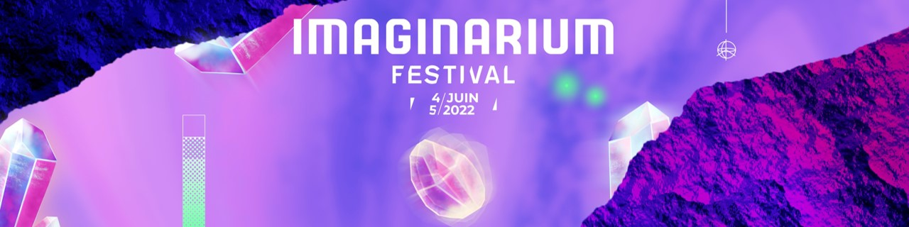

## Hi there ! I am Théo Kokel 🙋‍♂️
- 👨‍🎓 I am a french student in my last year of computer engineering at the UTC, the University of technology of Compiègne (France, Oise, 60)
- 😄 Smiley, happy, autonomous, curious, generous and bon vivant are adjectives that define me
- 🎮 I am passionate by video games since I can hold a controller, and I want to go further and turn my passion into my job
- ⚡ I also do a lot of sport, such as badminton, football, running and even skydiving !  

## Technologies I have worked with 💻
- Unity and C#
- C & C++
- Python
- Databases (SQL & noSQL) 
- R (Statistics and Machine Learning)

## Soft skills 💡
- Project management : notions in development life cycle (V, W, iterative, spiral, waterfall, Agile & Scrum)
- Experience in team leader position and budget control
- Happy and comfortable both in team work and autonomy
- Attentive and communicative

## What I am looking for 👀
I am searching a **6 months final year internship** to conclude my studies. I want to work in game development so I am looking for an internship in this domain. 
I am particularly interested in **gameplay and artificial intelligence**, but as I have already worked on multiplayer games, I would also enjoy to help on **online** issues.

## My projects 👨‍💻
### 2022
- [In development] : VR project developed by other students. I joined them to add AI to enhance interactions and immersion. / *feb. 2022 - july 2022*

### 2021 - 2022
- [WasteFair](https://github.com/KokelSan/WasteFair) : University project, multiplayer VR game for HTC Vive / *sept. 2021 - jan. 2022*
- [Nomad](https://github.com/KokelSan/Nomad) : University project, online board game (1v1) developed with a team of 24 / *sept. 2021 - jan. 2022*

### 2021
- [aPQlypse](https://github.com/KokelSan/aPQlypse) : Personal project, parodic game / *july 2021*  
- [Crocomine AI](https://github.com/KokelSan/Crocomine) : University project, automatic player to a Minesweeper variant game / *may 2021 - july 2021*
- [The Cratest Game](https://github.com/KokelSan/The-Cratest-game) : Personal project, online multiplayer game / *feb. 2021 - july 2021*
- [Library database](https://github.com/KokelSan/Library-database) : University project, Python program to manage a library's items and users / *feb. 2021 - july 2021*

### 2020 - 2021
- [Assistant engineer internship](https://github.com/KokelSan/HoloLens2-Internship) : Development of a Mixed Reality app for HoloLens 2 / *sept. 2020 - jan. 2021*

## My volunteer experience : The Imaginarium Festival epic 🚀

The Imaginarium Festival is an association which organises a music festival. It is fully driven by a group of students from the UTC. Since its creation in 2014, it has grown year after year to reach 13k festival-goers during its sixth edition, in june 2019. When I joined the UTC in september 2019, I felt in love with the project and I wanted to take part in this adventure. The festival is structured in a multitude of team, with one manager in charge of each. Those teams are divided in three poles, the technical one, the artistic one and the promotion one, and there is one director for each pole. The directors, the treasurers, the secretary and the president form the board. The board and the managers constitute the extanded board.
  
Unfortunately, the Covid era striked the world and both IF20 and IF21 had to be cancelled. Each cancellation brought disappointment, but it also strenghten my determination and commitment to the project. This is why I stayed in the organisation, because I couldn't leave the project without having seen it realised. Staying also allowed me to climb the organisation ladder to the decision core of the festival, which gave me more responsibilities and tought me a lot.

You can take a look at the first announced artists at [imaginariumfestival.com](https://imaginariumfestival.com/) if you are interested in the festival ! 😃
 
### IF22 (from sept. 2021) : Technical Director
After 2 years of involvement in the festival, I knew its inner workings well and felt ready to assume even more responsibilities. This is how I became the director of the technical pole which contains the logistic team (equipment, plannings, establishment, transports), the food one (food-trucks, catering, bar), the security one and the technical one (sound, light, stages). In that way I was the director of the managers of the 3 first teams and I was the direct manager of the technical one, for a total of 25 people and a budget of several hundreds of thousands of euros. As a director I was member of the board (and the extended board). This position obviously brings a lot more work and responsibilities but being part of the decision core and having an important voice is very gratifying and enriching. 

### IF21 (sept. 2020 - july 2021) : Head of Security
After my first steps in the association, I was given more responsibilities as I was responsible of the security measures and protocols in the festival. This position brings a lot of work and more pressure on me than my former one. The apex of my job was the writing of the security file which is given to the authorities. It is a document where the event is described as precise as possible. It is the one and only material on which the local authorities base their decision to approve the event or not. Despite our efforts to restructure the event to be as "covid friendly" as we could, we were not approved and able to realise our project. This position was also my first time as a team leader as I had 5 persons in my "securiteam". My part here was to define their areas of work, guide them and make sure they were working as we planned it during our meetings. As the head of security I was member of the extanded board.

### IF20 (sept. 2019 - july 2020) : Head of Transports
The first time I joined the organisation was in the logistic team as the transports manager. As the festival is a few kilometers away from the center of Compiègne, we put free shuttles in place, so people from the city and those coming by train can go to the festival. My job was then to determine the quantity, plan those shuttles and book them with a defined budget. I was also in charge to organise bus trips for schools across the country we partner with.

## My networks 🛰️

 

